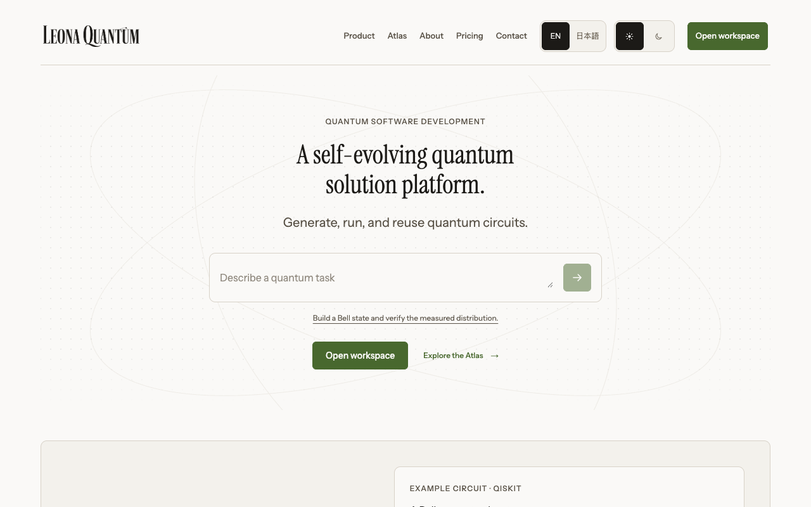
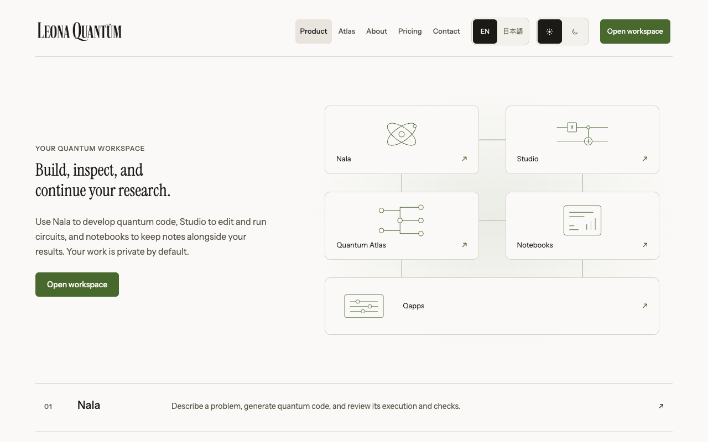
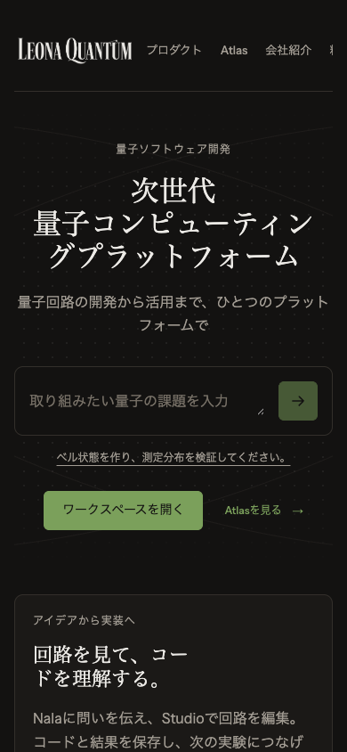

# Public site second pass, 2026-09-09

Branch: `feature/ux-polish-20260909`, based on `3909d3db` (PR 852, the first pass, live on leonaqt.com).
Execution record: `/Users/Eshaan/Developer/ai-ops/desk/leona/plans/ux-revamp-20260906/PHASE-2.md` and `PROGRESS.md`.

## Owner direction

Restore the original homepage headline, subheadline and body. Bring back the background and purposeful motion. More room between text and borders. Fewer repeated oversized titles and repeated explanations; secondary pages composed differently from the cover. Diagrams and images where they explain a relationship. No redundant About Leona block. The theme must survive a language switch. PR 855's header and pricing intent is binding: one header row with every link and preference, four original plan cards without unfinalized prices.

## Changes

| Surface | Change |
| --- | --- |
| Home | The original EN/JA hero copy ("A self-evolving quantum solution platform." / 次世代 量子コンピューティングプラットフォーム) centred over the pointer-reactive grid, which now pauses offscreen, when the tab is hidden and under reduced motion. The prompt sits inside the hero. A worked Bell-circuit section follows, then the five surfaces with small SVG glyphs, the walkthrough video (manual playback kept), the evidence and benchmark sections, and a closing card. Only the homepage uses the largest display size. |
| Product (`/workspace`) | A connected map of Nala, Studio, Atlas, Notebooks and Qapps, then a readable tool index and the three-step loop. |
| About | Team-led: the founding-team heading and portraits given room, the who-it-is-for strip, the contact card. The hero and manifesto repeats are gone; every name, role, affiliation and biography fact is unchanged. |
| Contact | The introduction and reasons beside the form instead of above it. The reasons list is a labelled section. |
| Pricing, legal | Bounded reading widths, smaller titles. Four original cards with feature lists and actions; no amounts, cadence, TBD labels or Recommended badge. The introduction says once that pricing is undecided. The signed-in upgrade page and the search description carry the same wording. |
| Header | One row at every width with all links, language and theme controls and the workspace action; horizontal scroll on narrow screens; a focused control is scrolled fully into view. The hamburger disclosure from the first pass is removed. |
| Theme | A document-level controller re-applies the stored theme after Next replaces the root element on a locale change, and both toggles read one store, so the pressed state, the palette and the reading language agree after every switch and reload. The palette switches in one frame with transitions suspended. |
| Motion | `Reveal` is a single 8 px settle on first view, transform only, so content never depends on JavaScript to be visible; disabled under reduced motion. The Nala start screen's orbit settles once on load. |
| Links | Public links into the signed-in app are plain anchors, so nothing prefetches an auth redirect. |
| Composer | The keyboard hint in the Nala composer meets WCAG AA contrast in both themes. |

## Verification, Node 24

- Web typecheck clean; 1,558 web unit tests; 81 rendered form tests, including the new theme tests (locale root replacement restores the choice and keeps both controls agreeing; a change from another tab updates the page).
- Full web lint (source bytes, test list, workspace inventory, raw hex, token variables, hit targets, repository data, catalog manifest, width families, layer graph, ingredients, region joins, paper register, attestation coverage, math, match gauge, zoo and Classiq parity) passes. Shared UI hex, token and permitted-animation checks pass. Shared UI axe suite: 295 passed.
- Production build: 1,047 static pages.
- Production-build browser script (`evidence/phase2-browser.mjs`): explicit and system theme preferences survive EN↔JA, refresh and reload at 320/390/1440 and both controls agree; the header is one row with every control keyboard-reachable inside its scroll frame; eight public routes have no horizontal overflow at 1440/768/390/320 and zero WCAG A/AA axe violations in both themes; four pricing cards with no price, cadence or badge elements; no request to the auth provider before intentional navigation; no page errors; no running animation under reduced motion; the video stays paused with native controls.
- Signed-in surfaces on the development-auth server, backend absent: Run, Notebooks, Studio and Qapps have no overflow at 1280/390; Notebooks, Studio and Qapps have zero axe violations; the Nala orbit plays its one-time entrance and nothing animates under reduced motion; the composer hint was the one contrast failure, fixed here.
- Screenshots below are from the local production build. Live execution, payment and hardware runs are not inferred from any of this.

## Screenshots

