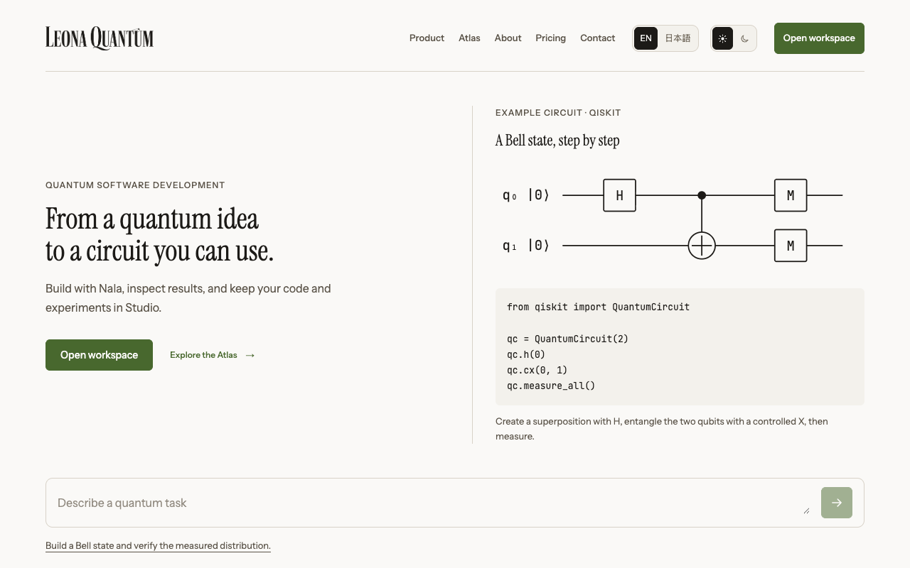
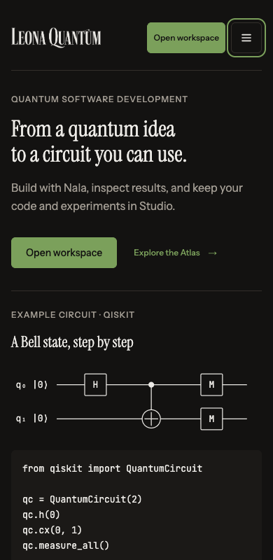
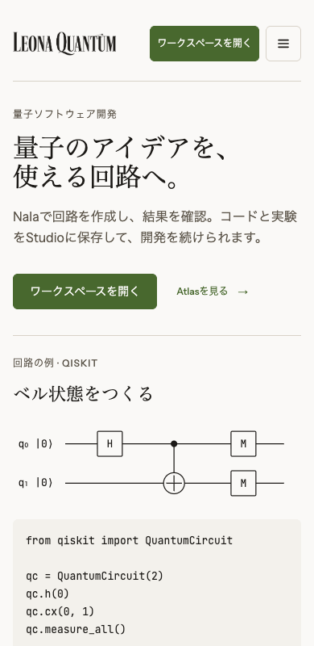

# Leona experience revamp

The public website, workspace and Nala now use a simpler layout, clear primary actions, stable navigation and recoverable async states. The implementation keeps existing execution, sharing, billing and scientific-data contracts.

## Changes

- Public website: concise English/Japanese copy, a Bell-state circuit and matching Qiskit example, direct workspace entry, responsive navigation, manual video playback and complete contact-form feedback.
- Workspace: searchable navigation, stable mobile/desktop sidebar preferences, focus handling, useful loading/error states, grouped Studio/notebook/course/Qapp controls and protected notebook edits.
- Nala: a quieter start screen, atomic attachments, duplicate-submission guards, resumable connection feedback, predictable scrolling and accessible result charts.
- Atlas: stable search/filter controls, immediate Enter search, consistent category links and compact navigation to maps, papers and claims.
- Shared visuals: readable dark captions, visible initial content and fewer decorative animations.

## Verification

The production build generated all 1046 static pages. The full TypeScript workspace checks passed, including 1557 web units. All 79 rendered form tests passed. Browser regressions cover dirty notebook exits, Studio editor-to-list navigation, mobile focus, open filters during search, duplicate submissions and attachments. Public browser checks cover eleven rendered routes, dark mode, Japanese, narrow header controls, and manual video playback under both motion preferences. The disabled public demo route is checked as an auth redirect, not reported as a rendered demo.

Local workspace browser journeys use development auth and recorded fixtures; no production backend execution, billing or hardware run is claimed from those fixtures. Release identity and live-page checks are recorded separately after deployment.

## Screenshots

Captured from the local production build.

